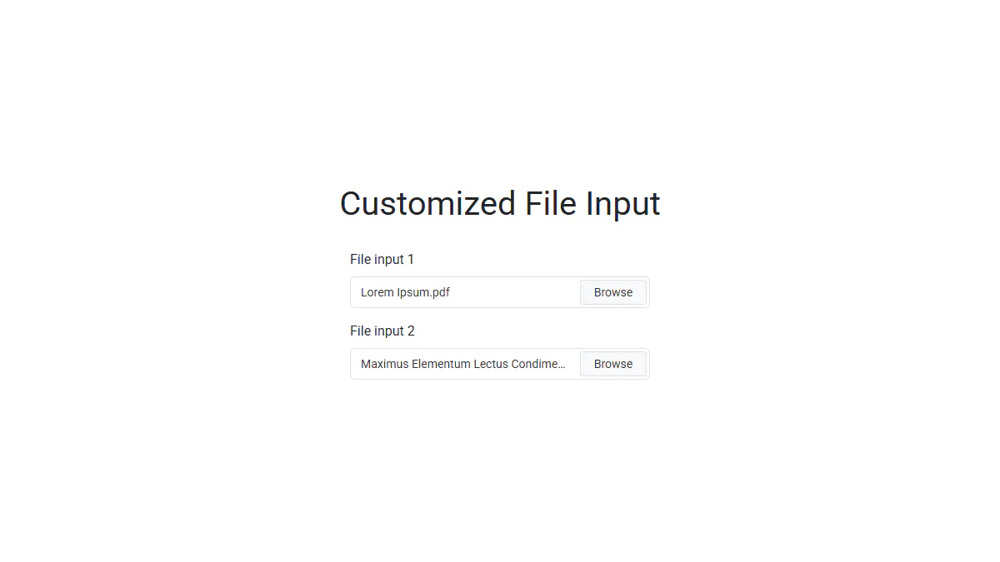

# Customized File Input

A pure JavaScript plugin that enhances the native `<input type="file">` with decorative elements,
allowing to achieve any visual appearance while maintaining full functionality.

**Live Demo:** https://demo.arsen.pro/javascript/customized-file-input/


## Screenshots

<kbd>
  
</kbd>


## Features

* Fully customizable fake input and browse button
* Handles long file names gracefully with ellipsis
* Keyboard accessible
* Responsive layout
* Semantic markup
* Dependency-free
* Lightweight
* Translatable


## Technologies

* JavaScript
* HTML
* CSS


## How to Use

### Setup

Include `customized-file-input.css` and `customized-file-input.js`.


### Initialization

```js
const input = document.querySelector('input[type="file"]');

// Default options
new CustomizedFileInput(input);

// Custom options
new CustomizedFileInput(input, {
  fakeBtnText: 'Select File'
});
```


## Options

| Option              | Type     | Default                               | Description                                                                         |
|---------------------|----------|---------------------------------------|-------------------------------------------------------------------------------------|
| `fakeBtnText`       | `string` | `'Browse'`                            | Text displayed inside the fake button                                               |
| `classes`           | `object` | `{...}`                               | CSS class names                                                                     |
| `classes.wrapper`   | `string` | `'customized-file-input'`             | CSS class for the wrapper element containing the file input and decorative elements |
| `classes.fakeInput` | `string` | `'customized-file-input__fake-input'` | CSS class for the fake input where the selected file name is displayed              |
| `classes.fakeBtn`   | `string` | `'customized-file-input__fake-btn'`   | CSS class for the fake button                                                       |