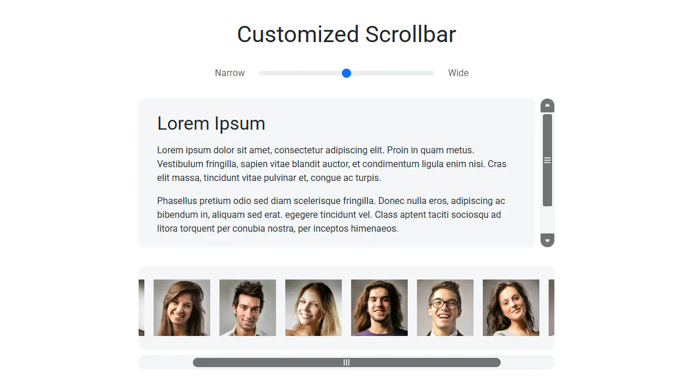

# Customized Scrollbar

A JavaScript plugin that creates a custom scrollbar with complete control
over its visual appearance. It provides both horizontal and vertical scrolling,
optional arrow buttons, and smooth GSAP-powered animations.

**Live Demo:** https://demo.arsen.pro/javascript/customized-scrollbar/


## Screenshots

<kbd>
  
</kbd>


## Features

* Fully customizable appearance
* Simple theming with CSS variables
* Vertical and horizontal scrolling
* Optional arrow buttons
* Responsive scrollbar layout
* Dynamic scrollbar creation and removal on container resize
* Automatic handle sizing based on content length
* Complete mouse, wheel, and keyboard navigation
* Track click scrolling
* Smooth GSAP-powered scrolling animations


## Technologies

* JavaScript
* GSAP
* HTML
* CSS


## How to Use

### Setup

Include the following assets in your page:

1. GSAP
2. `customized-scrollbar.css`
3. `customized-scrollbar.js`
4. `icons` directory containing two SVG icons.


### Markup

Use one of the following markup structures depending on the scrolling direction.


#### Vertical scrolling

```html
<div class="customized-scrollbar customized-scrollbar--vertical">
  <div class="customized-scrollbar__container">
    <div class="customized-scrollbar__content">
      <!-- your content -->
    </div>
  </div>
</div>
```


#### Horizontal scrolling

```html
<div class="customized-scrollbar customized-scrollbar--horizontal">
  <div class="customized-scrollbar__container">
    <div class="customized-scrollbar__content">
      <!-- your content -->
    </div>
  </div>
</div>
```


### Initialization

```js
const container = document.querySelector('.customized-scrollbar');

// Default configuration
new CustomizedScrollbar(container);

// Custom configuration
new CustomizedScrollbar(container, {
  showArrows: false
});
```


### Public API

The plugin exposes a single public method:

```js
const scrollbar = new CustomizedScrollbar(container);

// Destroy the scrollbar instance
scrollbar.destroy();
```


## Options

| Option                 | Type      | Default                                  | Description                                                              |
|------------------------|-----------|------------------------------------------|--------------------------------------------------------------------------|
| `showArrows`           | `boolean` | `true`                                   | Enables scrollbar arrow buttons                                          |
| `minHandleSize`        | `string`  | `'20%'`                                  | Minimum handle size as a percentage of the track                         |
| `maxHandleSize`        | `string`  | `'100%'`                                 | Maximum handle size as a percentage of the track                         |
| `wheelScrollStep`      | `number`  | `10`                                     | Scrolling distance per mouse wheel step (in pixels)                      |
| `scrollDuration`       | `number`  | `600`                                    | Maximum scrolling animation duration (in milliseconds)                   |
| `classes`              | `object`  | `{...}`                                  | CSS class names used by the plugin                                       |
| `classes.horizontal`   | `string`  | `'customized-scrollbar--horizontal'`     | CSS class applied to the root element for horizontal scrolling           |
| `classes.vertical`     | `string`  | `'customized-scrollbar--vertical'`       | CSS class applied to the root element for vertical scrolling             |
| `classes.initialized`  | `string`  | `'customized-scrollbar--initialized'`    | CSS class applied to the root element after plugin initialization        |
| `classes.noArrows`     | `string`  | `'customized-scrollbar--no-arrows'`      | CSS class applied to the root element when arrow buttons are disabled    |
| `classes.container`    | `string`  | `'customized-scrollbar__container'`      | CSS class for the scrollable container                                   |
| `classes.content`      | `string`  | `'customized-scrollbar__content'`        | CSS class for the scrollable content                                     |
| `classes.track`        | `string`  | `'customized-scrollbar__track'`          | CSS class for the scrollbar track                                        |
| `classes.handle`       | `string`  | `'customized-scrollbar__handle'`         | CSS class for the scrollbar handle                                       |
| `classes.handleActive` | `string`  | `'customized-scrollbar__handle--active'` | CSS class applied while the handle is dragged                            |
| `classes.arrow`        | `string`  | `'customized-scrollbar__arrow'`          | CSS class for scrollbar arrow buttons                                    |
| `classes.arrowActive`  | `string`  | `'customized-scrollbar__arrow--active'`  | CSS class applied while an arrow button is pressed                       |
| `classes.arrowStart`   | `string`  | `'customized-scrollbar__arrow--start'`   | CSS class for the left or top arrow button, depending on orientation     |
| `classes.arrowEnd`     | `string`  | `'customized-scrollbar__arrow--end'`     | CSS class for the right or bottom arrow button, depending on orientation |