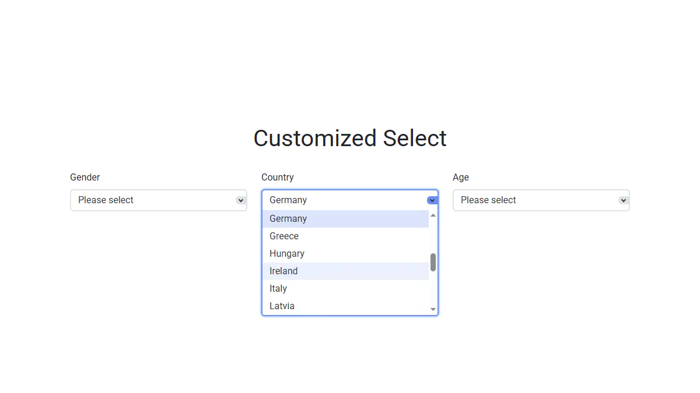

# Customized Select

A pure JavaScript plugin that creates a custom dropdown UI while keeping the native `<select>`
fully functional and supporting both mouse and keyboard interactions.

**Live Demo:** https://demo.arsen.pro/javascript/customized-select/


## Screenshots

<kbd>
  
</kbd>


## Features

* Native `<select>` remains functional
* UI synchronized with native `<select>`
* Width: any CSS unit or auto-calculated
* Options list scrolls when exceeding the limit
* Automatic z-index to appear above page content
* Keyboard accessible (Tab, Enter, Space, Arrow keys, Esc)
* Customizable
* Smooth transitions
* Responsive layout
* Semantic markup
* Dependency-free
* Lightweight


## Technologies

* JavaScript
* HTML
* CSS


## How to Use

### Setup

Include `customized-select.css` and `customized-select.js`.


### Initialization

```js
const select = document.querySelector('select');

// Default options
new CustomizedSelect(select);

// Custom options
new CustomizedSelect(select, {
  width: '100%',
  visibleOptions: 6
});
```


## Options

| Option                     | Type                       | Default                                    | Description                                                                             |
|----------------------------|----------------------------|--------------------------------------------|-----------------------------------------------------------------------------------------|
| `width`                    | `string \| number \| null` | `null`                                     | Custom width of the ui-select; accepts any valid CSS width; if null, auto-calculated    |
| `visibleOptions`           | `number`                   | `0`                                        | Maximum number of visible options before scrolling appears; if 0, all options are shown |
| `baseZIndex`               | `number`                   | `100`                                      | Base z-index applied to each ui-select to appear above page content                     |
| `classes`                  | `object`                   | `{...}`                                    | CSS class names                                                                         |
| `classes.wrapper`          | `string`                   | `'customized-select'`                      | CSS class for the wrapper element                                                       |
| `classes.wrapperSelected`  | `string`                   | `'customized-select--selected'`            | CSS class for the wrapper element applied when the ui-select is open                    |
| `classes.uiSelect`         | `string`                   | `'customized-select__ui'`                  | CSS class for the ui-select element                                                     |
| `classes.uiSelectValue`    | `string`                   | `'customized-select__ui-value'`            | CSS class for the element showing the selected value                                    |
| `classes.uiSelectArrow`    | `string`                   | `'customized-select__ui-arrow'`            | CSS class for the dropdown arrow                                                        |
| `classes.uiOptionsList`    | `string`                   | `'customized-select__ui-options'`          | CSS class for the options list container                                                |
| `classes.uiOption`         | `string`                   | `'customized-select__ui-option'`           | CSS class for each option in the list                                                   |
| `classes.uiSelectedOption` | `string`                   | `'customized-select__ui-option--selected'` | CSS class for the currently selected option                                             |