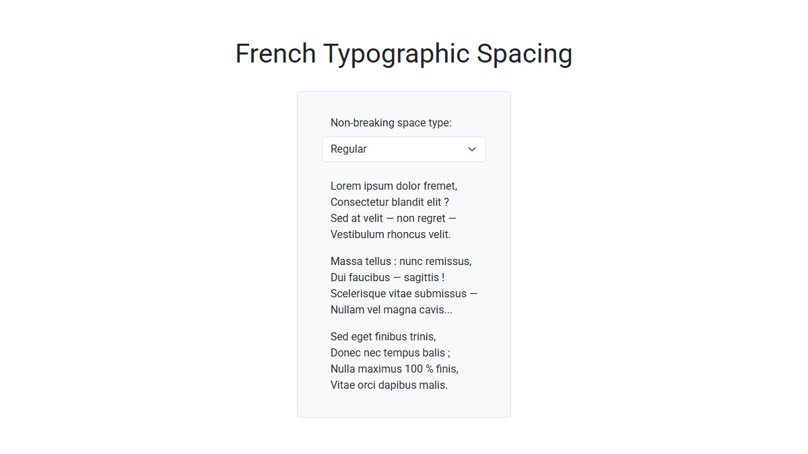

# French Typographic Spacing

A pure JavaScript plugin that adds non-breaking spaces before punctuation marks,
following French typographic rules.

## Preview

<kbd>
  
</kbd>

&nbsp;

**Live Demo:**
[https://demo.arsen.pro/javascript/french-typographic-spacing/](https://demo.arsen.pro/javascript/french-typographic-spacing/)

## Features

* Customizable
* Dependency-free
* Lightweight

## Technologies

* JavaScript (ES6+)

## How to Use

1. Include `french-typographic-spacing.js` in your page.
2. Initialize the plugin with default or custom options.

## Options

| Option              | Type                                      | Default                                                                                      | Description                                                                                                                                                                                                                       |
|---------------------|-------------------------------------------|----------------------------------------------------------------------------------------------|-----------------------------------------------------------------------------------------------------------------------------------------------------------------------------------------------------------------------------------|
| `nbspType`          | `'none'` `'narrow'` `'regular'` | `'regular'`                                                                                  | Type of non-breaking space to insert: - `'none'`: Do not insert any non-breaking spaces and remove existing ones - `'narrow'`: Insert narrow non-breaking spaces - `'regular'`: Insert regular non-breaking spaces |
| `insertBeforeChars` | `string`                                  | `'?!:;%'`                                                                                    | Characters before which a non-breaking space should be inserted                                                                                                                                                                   |
| `skipTags`          | `string[]`                                | `'STYLE'` `'SCRIPT'` `'NOSCRIPT'` `'IFRAME'` `'INPUT'` `'TEXTAREA'` | HTML tags to skip when processing                                                                                                                                                                                                 |