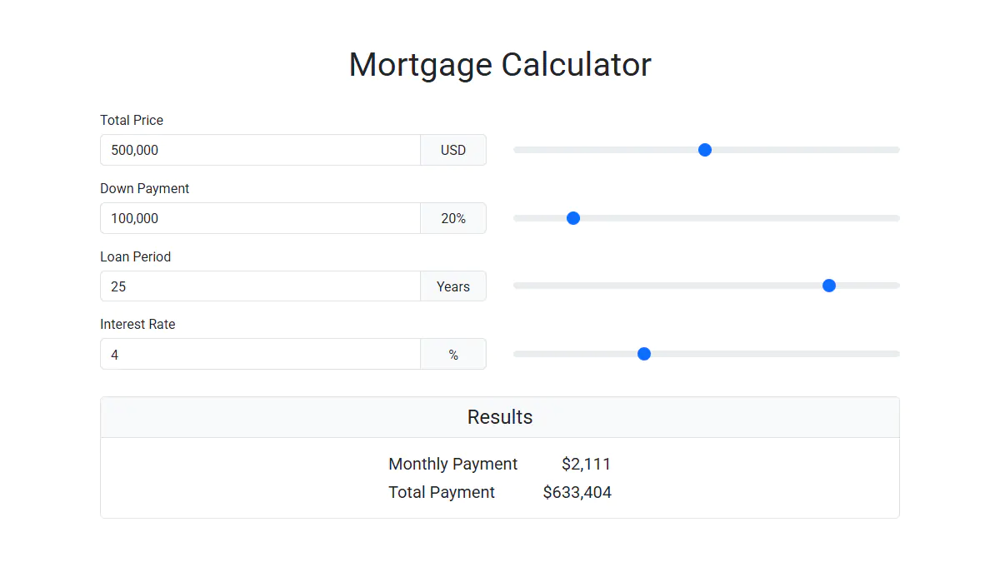

# Mortgage Calculator

A pure JavaScript plugin that calculates monthly and total mortgage payments.
Each input field is paired with a slider for fast and intuitive data entry.

**Live Demo:** https://demo.arsen.pro/javascript/mortgage-calculator/


## Screenshots

<kbd>
  
</kbd>


## Features

* Slider controls for inputs
* Customizable
* Keyboard accessible
* Responsive layout
* Semantic markup
* Dependency-free
* Lightweight
* Translatable


## Technologies

* JavaScript
* HTML
* CSS
* Bootstrap


## How to Use

### Setup

Include the following assets in your page:

* `mortgage-calculator.css`
* `mortgage-calculator.js`


### Markup

Copy the markup from `mortgage-calculator.html`.

```html
<div id="mortgage-calculator">...</div>
```


### Initialization

```js
const calculator = document.getElementById('mortgage-calculator');

// Default configuration
new MortgageCalculator(calculator);

// Custom configuration
new MortgageCalculator(calculator, {
  price: 500000,
  maxPrice: 1000000
});
```


## Options

| Option            | Type     | Default   | Description                               |
|-------------------|----------|-----------|-------------------------------------------|
| `price`           | `number` | `1000000` | Initial property price (in USD)           |
| `downPayment`     | `number` | `20`      | Initial down payment (in percent)         |
| `loanPeriod`      | `number` | `25`      | Initial loan period (in years)            |
| `interestRate`    | `number` | `4`       | Initial interest rate (in percent)        |
| `minPrice`        | `number` | `10000`   | Minimum allowed price (in USD)            |
| `maxPrice`        | `number` | `2000000` | Maximum allowed price (in USD)            |
| `minDownPayment`  | `number` | `10`      | Minimum allowed down payment (in percent) |
| `maxDownPayment`  | `number` | `80`      | Maximum allowed down payment (in percent) |
| `minLoanPeriod`   | `number` | `1`       | Minimum loan period (in years)            |
| `maxLoanPeriod`   | `number` | `30`      | Maximum loan period (in years)            |
| `minInterestRate` | `number` | `1`       | Minimum interest rate (in percent)        |
| `maxInterestRate` | `number` | `10`      | Maximum interest rate (in percent)        |