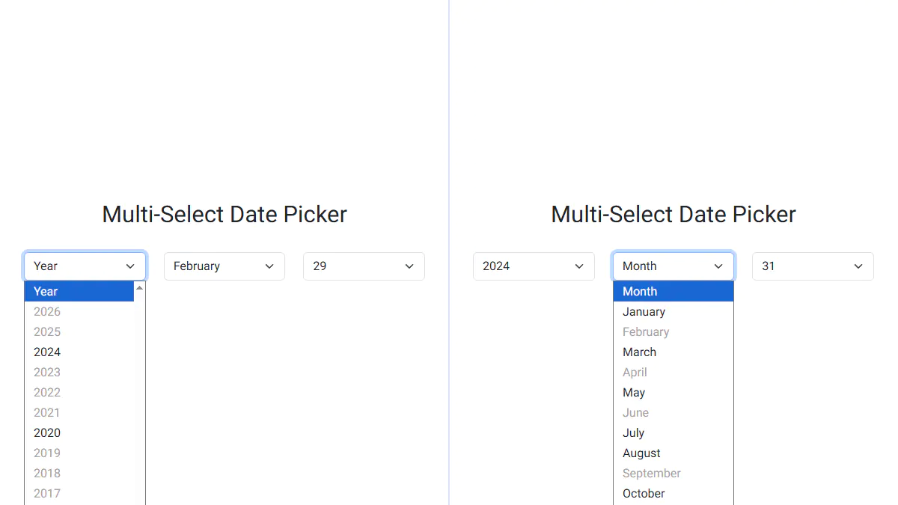

# Multi-Select Date Picker

A pure JavaScript plugin for selecting a date using three synchronized `select` boxes
(year, month, day). Prevents selecting invalid dates.

**Live Demo:** https://demo.arsen.pro/javascript/multi-select-date-picker/


## Screenshots

<kbd>
  
</kbd>


## Features

* Customizable
* Keyboard accessible
* Dependency-free
* Lightweight


## Technologies

* JavaScript
* HTML


## How to Use

### Setup

Include `multi-select-date-picker.js`.


### Markup

Add a container with three `select` elements for the year, month, and day.

```html
<div id="date-picker">
  <select id="date-year">
    <option value="">Year</option>
  </select>

  <select id="date-month">
    <option value="">Month</option>
  </select>

  <select id="date-day">
    <option value="">Day</option>
  </select>
</div>
```


### Initialization

```js
const container = document.getElementById('date-picker');

// Default options
new MultiSelectDatePicker(container);

// Custom options
new MultiSelectDatePicker(container, {
  yearSelector: '#my-year',
  monthSelector: '.my-month',
  daySelector: 'select:last-of-type'
});
```


## Options

| Option          | Type     | Default         | Description                       |
|-----------------|----------|-----------------|-----------------------------------|
| `yearSelector`  | `string` | `'#date-year'`  | CSS selector for the year select  |
| `monthSelector` | `string` | `'#date-month'` | CSS selector for the month select |
| `daySelector`   | `string` | `'#date-day'`   | CSS selector for the day select   |