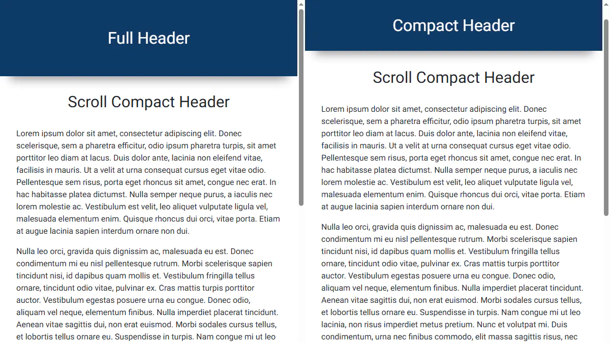

# Scroll Compact Header

A minimal pure JavaScript plugin that shrinks the header height when the page is scrolled down
and restores it when scrolled back to the top.

**Live Demo:** https://demo.arsen.pro/javascript/scroll-compact-header/


## Screenshots

<kbd>
  
</kbd>


## Features

* Smooth height transitions
* Responsive layout
* Dependency-free
* Lightweight


## Technologies

* JavaScript
* HTML
* CSS


## How to Use

### Setup

Include `scroll-compact-header.css` and `scroll-compact-header.js`.


### Initialization

```js
const header = document.getElementById('header');

// Default options
new ScrollCompactHeader(header);

// Custom options
new ScrollCompactHeader(header, {
  compactClass: 'header-small'
});
```


## Options

| Option         | Type     | Default            | Description                                       |
|----------------|----------|--------------------|---------------------------------------------------|
| `compactClass` | `string` | `'header-compact'` | CSS class applied when the header becomes compact |